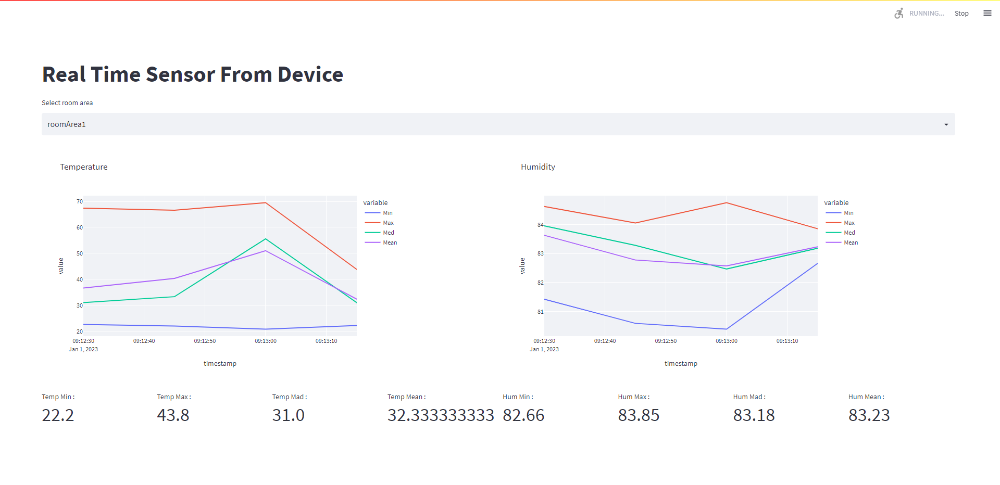

# IoT Application Developer Tech Test – Imam Syahrizal

## Task 1 - Salary Conversion
The Python code for task 1 was created on Google Collaboratory. JSON file is stored in Google Drive. The exchange rate is obtained from https://api.frankfurter.app/  

### Library used in this code : 
1. Pandas will be used to process the data frame. 
2. Requests for the current exchange rate. 
3. Phonenumber to phone number cleaning format.  

### Simulate
This code can be try on google colab and need to set the JSON File location in code

## Task 2 - Sensor Aggregation
Google Collaboratory was used to create this code. JSON file is stored in Google Drive. The Pandas library is the only one used in this code.  
### Simulate
This code can be try on google colab and need to set the JSON File location in code

## Task 3 - Sensor Aggregation Simulation
Web based application made by Streamline Python.  

### Library used in this project : 
1. The Streamlit v1.11.0 library was used to generate the dashboard.
2. Numpy to generate a random value
3. Pandas to process the data frame
4. Time to pause
5. Plotly.express to make a live graph
6. Datetime to get the current time  

The data in this project is organized by room area and every 15 seconds (rather than by day to show when it is simulated).  
Not fully finished, no button, and only displays real-time data. This program cannot generate a JSON file because there is no button. 
### Simulate
To simulate this app is install all library requirement.txt and type streamline run Task3.py.  
)
Link Video : https://drive.google.com/file/d/1kMiTe0GE0PwsBzELcU7mMKe33QPfxsFu/view?usp=sharing 
